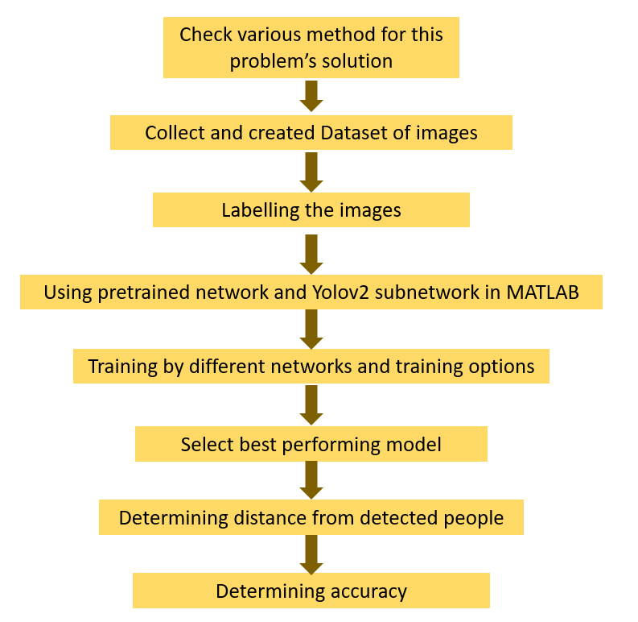

# Social-Distance-Monitoring-in-Covid19-Situation

#### **Overview**

An object detection system built using YOLOv2 to detect people in images and videos and estimate interpersonal distances for social distancing monitoring. The project demonstrates practical application of deep learning–based object detection for real-world scenarios.

#### **Key Features**

* Person detection and bounding box localization
* Distance approximation between detected individuals
* Visual safety alerts for distance violations
* Modular and extensible design

#### **Workflow**

#### **Tech Stack**

* Language: MATLAB
* Framework: Deep Learning Toolbox
* Model: YOLOv2 with Darknet-53 backbone
* Domain: Computer Vision, Object Detection

#### **Dataset**

* ~800+ annotated pedestrian images
* Combination of CCTV video frames and public datasets
* Ground truth labeling using MATLAB Image Labeler

#### **Model Architecture**

Input: 256 × 256 × 3

Backbone: Darknet-53

Detection Head: YOLOv2

Classes: Person

Training Configuration

Optimizer: Adam

Learning Rate: 1e-4

Batch Size: 16

Epochs: 25 (two-stage training)

#### **Results**

* Achieved strong baseline detection performance
* Reliable person localization across varied scenes
* Identified performance gains possible with newer YOLO variants

#### **Limitations**

* Distance estimation is approximate (2D projection)
* Limited training epochs due to hardware constraints
* Not calibrated for real-world metric accuracy

#### **Future Work**

* Migrate to YOLOv3/YOLOv5/YOLOv8
* Improve distance estimation via camera calibration
* Optimize for real-time deployment
* Expand dataset for improved generalization

#### Project Status

✅ Completed — Baseline implementation

🔧 Open for enhancements and upgrades

#### **License**

This project is for academic and educational purposes.

