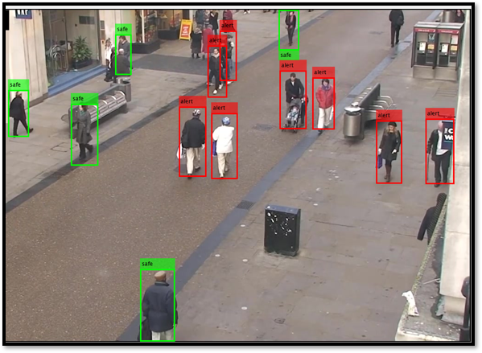

# Social Distance Monitoring in COVID-19 Situation

## Overview

This project presents a **deep learning–based social distance monitoring system** using **YOLOv2** to detect people in images and videos and estimate interpersonal distances. The work demonstrates a practical application of object detection techniques for monitoring social distancing compliance in real-world environments.

---

## Key Features

- Person detection and bounding box localization  
- Approximate distance estimation between detected individuals  
- Visual safety alerts for distance violations  
- Modular and extensible system design  

---

## Workflow

---

## Tech Stack

- **Programming Language:** MATLAB  
- **Framework:** Deep Learning Toolbox  
- **Model:** YOLOv2 with Darknet-53 backbone  
- **Domain:** Computer Vision, Object Detection  

---

## Dataset

- Approximately **800+ annotated pedestrian images**  
- Combination of CCTV video frames and public datasets  
- Ground truth annotation using **MATLAB Image Labeler**

---

## Model Architecture

- **Input Size:** 256 × 256 × 3  
- **Backbone Network:** Darknet-53  
- **Detection Head:** YOLOv2  
- **Classes:** Person  

### Training Configuration

- **Optimizer:** Adam  
- **Learning Rate:** 1e-4  
- **Batch Size:** 16  
- **Epochs:** 25 (two-stage training)

---

## Results

- Strong baseline detection performance achieved  
- Reliable person localization across diverse scenes  
- Identified scope for improved performance using newer YOLO variants  

---

## Limitations

- Distance estimation is approximate due to 2D projection  
- Limited training epochs caused by hardware constraints  
- Not calibrated for real-world metric distance accuracy  

---

## Future Work

- Migration to YOLOv3 / YOLOv5 / YOLOv8  
- Improved distance estimation using camera calibration  
- Optimization for real-time deployment  
- Dataset expansion for better generalization  

---

## Project Status

✅ **Completed** — Baseline implementation  

🔧 **Open for enhancements and upgrades**

---

## Contributors

- Nahid Ahmed (1706145)  
- Sanath Kumar Das (1706149)  
- Md. Rokonujjaman (1706150)  
- Ishmam Hasnat Iram (1706153)  
- **Joy Saha (1706189)**  

Department of Electrical & Electronic Engineering  
Bangladesh University of Engineering and Technology (BUET)

---

## License

This project is for **academic and educational purposes only**.
